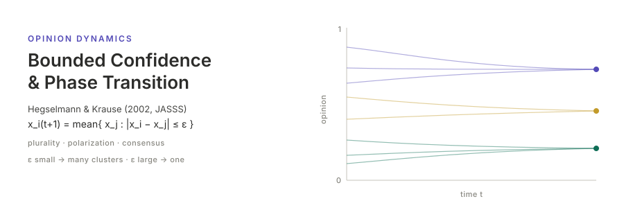

<p align="center"></p>

[English](README.md) | **日本語**

# Opinion Dynamics and Bounded Confidence — Hegselmann & Krause (2002)

Hegselmann & Krause (2002)「Opinion Dynamics and Bounded Confidence: Models, Analysis and Simulation」(*JASSS* 5(3), 2) の有界信頼 (BC) 意見力学モデルの再現実装である．各エージェントは連続意見 `x_i ∈ [0,1]` を持ち，毎ステップ自身の信頼集合 `I(i) = { j : |x_i − x_j| ≤ ε }` 内の意見の算術平均で自分の意見を更新する．ε の増大に伴い，多数の生存クラスタ (多元) → 2 陣営 (分極) → 単一合意，という相転移が現れる．シミュレーションは [socsim](https://github.com/akitenkrad/rs-social-simulation-tools) フレームワーク上の Rust で，可視化ツールは Python で実装している．

## インストールとクイックスタート

```bash
# Rust シミュレーションのビルド
cargo build --release

# 標準設定で実行 (n=625, ε=0.15, 一様初期分布, seed=42)
cargo run --release -- run --n 625 --eps 0.15 --start uniform --seed 42

# Python 可視化ツールのインストール (workspace ルートで)
uv sync

# 最新の実行結果を可視化 (意見軌跡 + メトリクス)
uv run hegselmann-bc-tools visualize
```

## ドキュメント

- [ユースケース](docs/usecases.ja.md) — 本プロジェクトでできること．他ドキュメントへの導線．
- [CLI](docs/cli.ja.md) — Rust CLI の `run` / `sweep` サブコマンドとフラグ．
- [可視化](docs/visualization.ja.md) — Python `hegselmann-bc-tools` と出力の読み方．
- [アーキテクチャ](docs/architecture.ja.md) — リポジトリ構成，socsim フレームワーク，BC 更新，参考文献．
- [再現](docs/reproduction.ja.md) — 論文 Figure の一括再現状況 (Phase 3 = 未着手)．

## スコープ

本リポジトリは **Phase 1** (完全グラフ上の対称 BC モデル，`run` サブコマンド，三相転移の基本再現; 論文 §4 ベースライン) と **Phase 2** (ε の `sweep` および Python の `visualize` / `visualize-sweep` / `show-experiment-settings` ツール) を実装している．**Phase 3** の非対称信頼 (`ε_l ≠ ε_r`; 論文 §4.2 / Fig. 10–13) は `run` サブコマンドの `--eps-l` / `--eps-r` で**対応済み**で，本体側の `HegselmannKrauseMechanism::with_asymmetric` (socsim-mechanisms PR #47) を流用している (独自 mechanism は不要だった)．Phase 3 の残作業は論文 Figure 一括再現 `reproduce_paper.py` のみ．

## 姉妹実装

[`hegselmann2005`](https://github.com/akitenkrad/hegselmann2005) は同著者の 2005 年 *Computational Economics* 論文の再現で，BC モデルを「どの平均で意見を集約するか」(A / G / H / P_p / R) という軸で一般化する．socsim の配線パターンを共有するが，論文ごとに別リポジトリとして意図的に分離している ── 本リポジトリは対称/非対称 ε と解析的な有限時間合意性質を担当し，姉妹リポジトリは平均演算子の比較を担当する．

## ライセンス

MIT

---
*This file was generated by Claude Code.*
